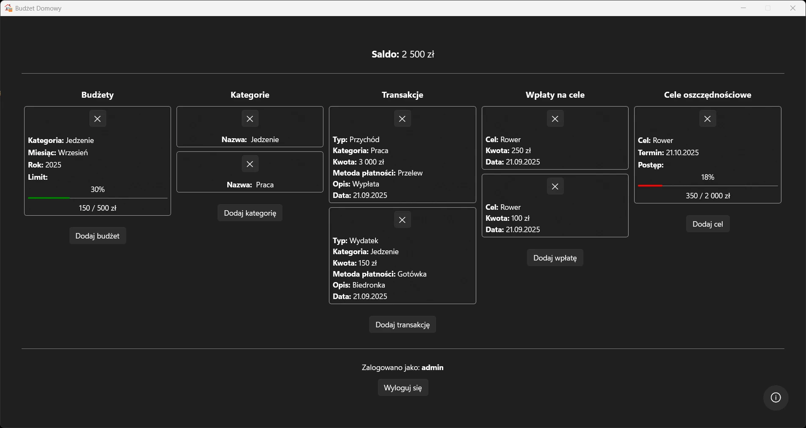


# 💸 MyBudgetApp

A household budget management app.  
Add income and expenses, track your balance, and analyze monthly finances.  
A simple, intuitive interface helps you control your daily spending.


## 🎬 Demo




## ✨ Features

- Single‑view dashboard: balance, budgets, categories, transactions, and goals
- Budgets by category with limits and progress (percent + bar)
- Categories: add and delete
- Transactions: income and expenses (amount, category, payment method, description, date)
- Instant balance update after each transaction
- Savings goals with target amount and due date, plus visual progress
- Goal contributions with per‑goal deposit history
- Quick actions on cards (add/remove)
- Windows 11 Mica backdrop; follows system Light/Dark theme; clean, panel‑based layout
- User accounts and authentication: sign‑up/sign‑in required; multi‑user support; per‑user data isolation; no roles or permissions
## 📦 Installation

Download
- [MyBudgetApp.zip](https://github.com/Hansik33/MyBudgetApp/releases/latest/download/MyBudgetApp.zip) — app (MyBudgetApp.exe + appsettings.json + LICENSE + CREDITS.md)
- [MyBudgetApp.sql](https://github.com/Hansik33/MyBudgetApp/releases/latest/download/MyBudgetApp.sql) — database dump

Requirements
- Windows 11
- MySQL Server 8.0
- .NET 8 Desktop Runtime (only if the build isn’t self‑contained)

Quick install (default config)
`appsettings.json` (included):
```json
{
  "ConnectionStrings": {
    "Default": "server=localhost;port=3306;database=mybudgetapp;user=root;password=qwertyz1234!"
  }
}
```
1) Install & start MySQL (localhost:3306).  
2) Create DB and import dump:
```bash
mysql -u root -p -e "CREATE DATABASE IF NOT EXISTS mybudgetapp CHARACTER SET utf8mb4 COLLATE utf8mb4_unicode_ci;"
mysql -u root -p mybudgetapp < MyBudgetApp.sql
```
3) Unzip `MyBudgetApp.zip` and run `MyBudgetApp.exe`.  
Tip: SmartScreen → More info → Run anyway.

Use your own config
Edit `appsettings.json` to match your DB:
```json
{
  "ConnectionStrings": {
    "Default": "server=localhost;port=3306;database=mybudgetapp_dev;user=mybudget;password=StrongPassword!"
  }
}
```

Recommended: create a dedicated DB user
```sql
CREATE USER 'mybudget'@'localhost' IDENTIFIED BY 'StrongPassword!';
GRANT ALL PRIVILEGES ON mybudgetapp.* TO 'mybudget'@'localhost';
FLUSH PRIVILEGES;
```

Update / Uninstall
- Update: replace files from a newer ZIP (keep your customized `appsettings.json`).
- Uninstall: delete the unzipped folder; drop the DB to remove data.

Security note
- The default root credentials are for local testing only. For your own setup, create a dedicated MySQL user and change the password.
## 🧭 Usage

1) Launch the app
   - Run `MyBudgetApp.exe`.

2) Create your account
   - Click Sign up, then Sign in. Data is isolated per user.

3) Set up basics
   - Add Categories (e.g., Food, Transport).
   - Create monthly Budgets per category (limit + month/year).

4) Record transactions
   - Add Income or Expense (amount, category, payment method, description, date).
   - Balance and budget progress update instantly.

5) Plan savings
   - Create Savings goals (name, target amount, due date).
   - Add Contributions to track progress toward each goal.

6) Manage and edit
   - Use quick actions on cards to add/remove items.
   - Open a card to edit details; deleting linked items may affect summaries.

Notes
- Budgets are month-scoped — create new ones for each month you track.
- The app follows your Windows light/dark theme automatically.
- Database connection comes from `appsettings.json` (ConnectionStrings:Default).


## 🚀 Deployment

Quick steps to build and package a Windows release from this repo.

Prerequisites
- Windows 11, Git, .NET SDK 8.0, MySQL 8.0 (for runtime usage)

1) Clone
```bash
git clone https://github.com/Hansik33/MyBudgetApp.git
cd MyBudgetApp
```

2) Publish (self-contained, win-x64, single file)
```bash
dotnet restore
dotnet publish ./MyBudgetApp/MyBudgetApp.csproj -c Release -r win-x64 --self-contained true -p:PublishSingleFile=true -p:IncludeNativeLibrariesForSelfExtract=true -o dist/MyBudgetApp
```

3) Include config and SQL dump
- Ensure `dist/MyBudgetApp/appsettings.json` has your connection string.
- Copy `MyBudgetApp.sql` next to the EXE (for users to import).

4) Ensure license and credits are included
- Place `LICENSE` and `CREDITS.md` next to the EXE (or configure the project to copy them automatically at publish):
```xml
<ItemGroup>
  <None Include="..\CREDITS.md" Link="CREDITS.md" CopyToOutputDirectory="PreserveNewest" />
  <None Include="..\LICENSE"    Link="LICENSE"    CopyToOutputDirectory="PreserveNewest" />
</ItemGroup>
```

5) Package
```powershell
Compress-Archive -Path dist/MyBudgetApp\* -DestinationPath MyBudgetApp.zip -Force
```

6) Release on GitHub
```bash
git tag vX.Y.Z
git push origin vX.Y.Z
```
- Create a new GitHub Release for tag `vX.Y.Z`.
- Upload `MyBudgetApp.zip` and `MyBudgetApp.sql`.

Notes
- For a smaller download (requires .NET 8 Desktop Runtime on target machines), publish framework-dependent:
```bash
dotnet publish ./MyBudgetApp/MyBudgetApp.csproj -c Release -o dist/MyBudgetApp
```


## 🆘 Support

If you run into a problem:
- Check existing issues: [Issues](https://github.com/Hansik33/MyBudgetApp/issues)
- Open a new issue and include:
  - Steps to reproduce
  - Screenshots or error messages
  - Environment: Windows version, MySQL version, app version


## 🙌 Credits

- Icon: “Budget” by nawicon, from [Flaticon](https://www.flaticon.com/free-icon/budget_6676709?term=home+budget&related_id=6676709).  
  Licensed under the [Flaticon License](https://www.flaticon.com/legal) (attribution required).  
  More details: see [CREDITS.md](CREDITS.md).
## 📜 License

Code: MIT — see [LICENSE](LICENSE).  
Third‑party assets retain their own licenses — see [CREDITS.md](CREDITS.md).

